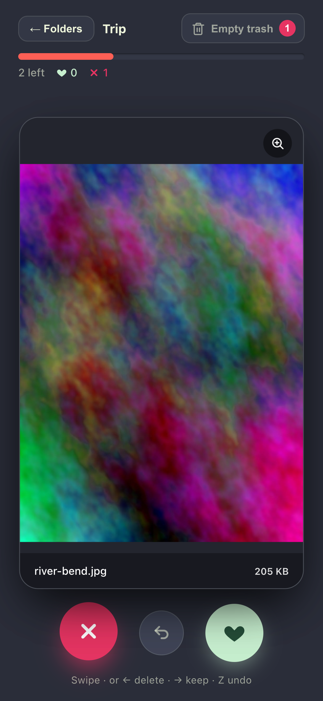
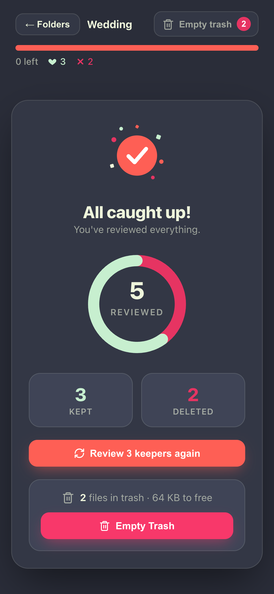
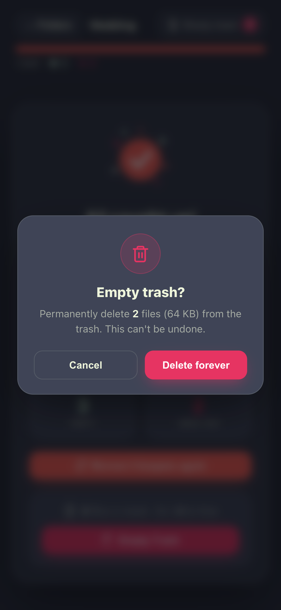
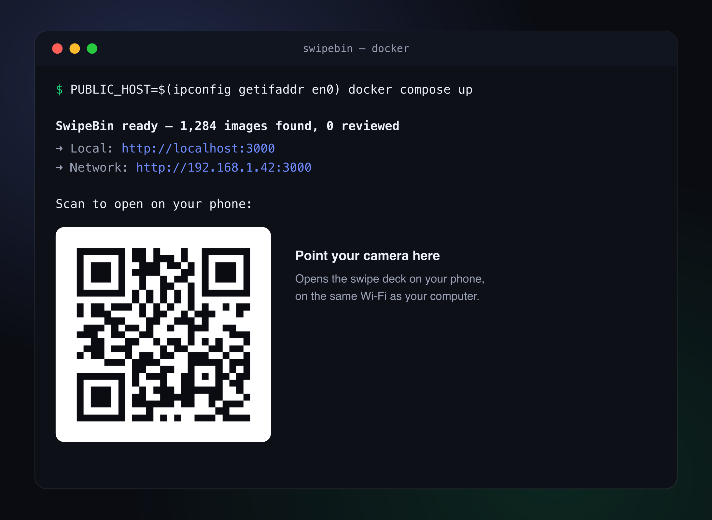

# 🗑️ SwipeBin

A Tinder-style photo culling app. Mount one or more folders of pictures, then **swipe right to keep** and **swipe left to delete** — one image at a time, on your phone or desktop.

- **Multiple folders** — mount several folders and pick which one to clean from a folder grid. Each shows its own progress, so the picker doubles as a **resume hub**: stop anytime, come back, continue where you left off.
- **Reversible deletes** — "deleted" images are moved into a `.trash/` folder inside that folder, never destroyed. An **Undo** button (or the `Z` key) restores the last one.
- **Reads everything** — JPEG, PNG, WebP, GIF, TIFF, HEIC/HEIF, AVIF **and RAW** (CR2, CR3, NEF, ARW, RAF, ORF, RW2, DNG, PEF, SRW, and more). RAW files are previewed by extracting their embedded JPEG with `dcraw`, so it's fast.
- **Remembers your decisions** — reviewed images don't come back, even after a restart.
- **Runs anywhere** — one Docker container.

## Screenshots

<p align="center">
  
  
  
</p>

On startup the container prints the URL **and a QR code** — scan it to open the deck on your phone:

<p align="center">
  
</p>

## Quick start (Docker)

Each folder you want to clean is mounted under `/data/folders/<name>`; the app lists them in a picker. Mount as many as you like.

1. Drop the folders to triage next to `docker-compose.yml` (or edit the volume lines to point anywhere), e.g.:

   ```bash
   mkdir -p photos
   cp /path/to/your/pictures/* photos/   # becomes the "Photos" collection
   ```

   To add more, add volume lines in `docker-compose.yml` — `- ~/Trip:/data/folders/Trip` — or with `docker run`, repeat `-v`:

   ```bash
   docker run --rm -p 3000:3000 \
     -e PUBLIC_HOST=$(ipconfig getifaddr en0) \
     -v ~/Pictures/Trip:/data/folders/Trip \
     -v ~/Camera/RAW:/data/folders/RAW \
     -v swipebin-data:/data/app \
     swipebin
   ```

2. Build and run:

   ```bash
   docker compose up --build
   ```

3. The container prints a banner with the URL **and a QR code** — open it:

   ```
   SwipeBin ready — 3 folders · 1,284 images
     ➜ Local:   http://localhost:3000
     ➜ Network: http://192.168.1.42:3000

   📱 Scan to open on your phone:
     █▀▀▀▀▀█ ▀▄█ ▄ █▀▀▀▀▀█
     █ ███ █ ▀█▀▀▄ █ ███ █
     █ ▀▀▀ █ █▀ ▀▀ █ ▀▀▀ █
     ▀▀▀▀▀▀▀ █ ▀ █ ▀▀▀▀▀▀▀
     ... (full QR) ...
   ```

   Open `http://localhost:3000` on this machine, or **scan the QR code** (or open the `Network` URL) from your phone on the same Wi-Fi. With several folders you'll see a **picker** first; with a single folder you go straight to the deck.

   > **Phone access:** inside Docker the auto-detected IP is the *container's*, which phones can't reach. For a scannable address, pass your computer's LAN IP:
   >
   > ```bash
   > PUBLIC_HOST=192.168.1.42 docker compose up --build
   > ```
   >
   > (find it with `ipconfig getifaddr en0` on macOS, or `hostname -I` on Linux). The QR and Network URL then point at the host.

### What happens on swipe

| Gesture | Action | Effect on disk |
| --- | --- | --- |
| Swipe **right** / Keep / `→` | Keep | File stays put, marked reviewed (won't reappear) |
| Swipe **left** / Delete / `←` | Delete | File moved to that folder's `.trash/<same path>` |
| Undo button / `Z` | Undo last | Restores the last delete; un-reviews a keep |

Each folder has its own `.trash/` and its own progress — decisions in one never affect another. Use **Empty Trash** on a folder's end screen (or the header button) to permanently free space; until then everything is recoverable from `.trash/`. The **← Folders** button returns to the picker (your progress is already saved).

## Configuration

Set via environment variables (see `docker-compose.yml`):

| Var | Default | Meaning |
| --- | --- | --- |
| `FOLDERS_DIR` | `/data/folders` | Parent dir; each immediate subdirectory is a collection to triage (mount each folder under it) |
| `IMAGES_DIR` | `/data/images` | Legacy single-folder fallback used when `FOLDERS_DIR` has no subdirs (mount one folder here) |
| `APP_DIR` | `/data/app` | Where `state.json` and the preview cache live |
| `PORT` | `3000` | HTTP port |
| `PREVIEW_WIDTH` | `1080` | Max width (px) of generated previews |
| `PUBLIC_HOST` | _(auto)_ | Host/IP used for the Network URL + QR code (set to your LAN IP in Docker) |
| `PUBLIC_URL` | _(auto)_ | Full external URL for the Network line + QR (overrides `PUBLIC_HOST`) |

State and the preview cache persist in the `swipebin-data` named volume, so your progress and generated previews survive restarts.

## Local development

Requires Node 20+ and `dcraw` on your PATH (`brew install dcraw` / `apt-get install dcraw`) for RAW support.

```bash
npm install
mkdir -p photos && cp /some/pictures/* photos/   # IMAGES_DIR defaults to ./photos in dev
npm run dev
```

- API + static server: http://localhost:3000
- Vite dev server (hot reload, proxies `/api`): http://localhost:5173

## How it works

```
folder mounts ──► /data/folders/<name>   (source images + per-folder .trash)
data volume   ──► /data/app                (state.json + preview cache)
                       ▲
   browser ◄─ React SPA ┤ Express :3000 ── sharp (standard) / dcraw (RAW)
```

- **Backend** — Node + Express (TypeScript). Discovers each folder under `FOLDERS_DIR`, scans it on demand, and serves a **folder-scoped** API (`/api/folders/:id/…`). Decisions live in an atomic JSON store namespaced per folder; previews are generated on demand and cached.
- **Frontend** — React + Vite (TypeScript). A hash-routed folder **picker** (`#/`) and **swipe session** (`#/f/<id>`), with `framer-motion` drag gestures for the deck. A single mounted folder skips the picker.
- **RAW** — `dcraw -e` extracts the embedded preview (fast); falls back to a full `dcraw` demosaic only when no embedded preview exists. The result is piped through `sharp` for resizing and orientation.

## API

All per-image routes are scoped to a folder id (from `GET /api/folders`).

| Method | Path | Description |
| --- | --- | --- |
| `GET` | `/api/folders` | All folders with per-folder stats, trash size, and a cover image id |
| `GET` | `/api/folders/:id/queue?limit=20` | Next undecided images in that folder |
| `GET` | `/api/folders/:id/images/:imageId/preview?w=1080` | Web-safe JPEG preview (cached) |
| `POST` | `/api/folders/:id/images/:imageId/decision` | Body `{ "action": "keep" \| "delete" }` |
| `POST` | `/api/folders/:id/undo` | Revert the last decision in that folder |
| `GET` | `/api/folders/:id/stats` | `{ total, reviewed, kept, deleted, remaining }` |
| `GET` / `POST` | `/api/folders/:id/trash` · `/trash/flush` | Trash size · permanently empty it |

## License

MIT
